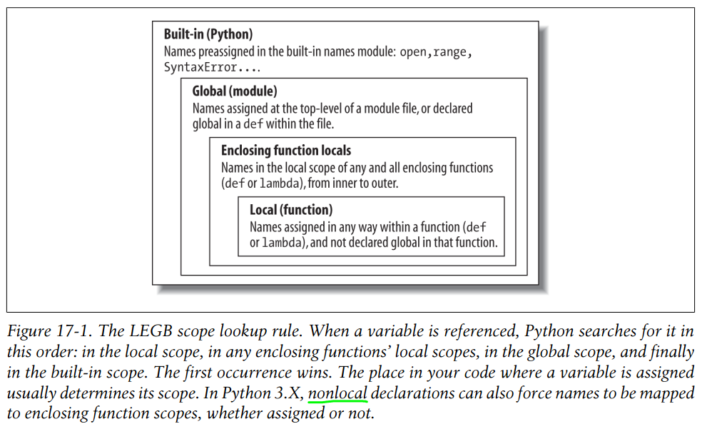
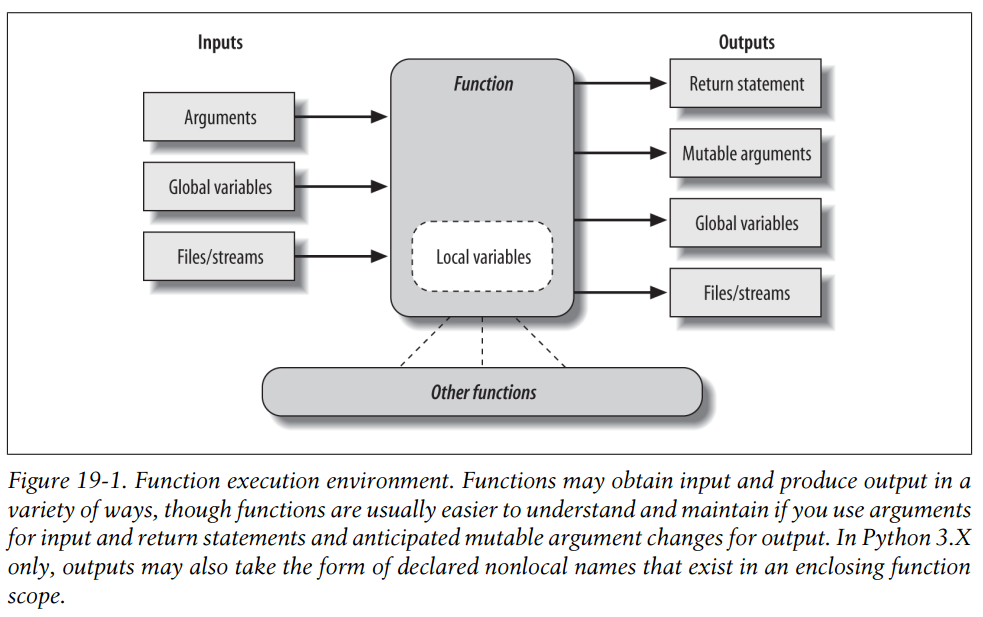

Functions
=========

1. basics
2. scope
3. argument
4. advanced topics

def
---

Format::

  def name(arg1, arg2, ..., argN):
    ...
    [return value]

Executes at runtime::

  if test:
    def func():
      print 'Define func this way'
  else:
    def func():
      print 'Or else this way'
  ...
  func()    # Call the func defined

In fact, besides calls, functions allow arbitrary attributes to be attached to record information for later use::

    >>> def func1():
    ...     print "hello world"
    ...
    >>> func1()
    hello world
    >>> func1.val1 = 'value'
    >>> func1.val1
    'value'
    >>> type(func1)
    <type 'function'>
    >>> dir(func1)
    ['__call__', '__class__', '__closure__', '__code__', '__defaults__', '__delattr__', '__dict__', '__doc__', '__format__', '__get__', '__getattribute__', '__globals__', '__hash__', '__init__', '__module__', '__name__', '__new__', '__reduce__', '__reduce_ex__', '__repr__', '__setattr__', '__sizeof__', '__str__', '__subclasshook__', 'func_closure', 'func_code', 'func_defaults', 'func_dict', 'func_doc', 'func_globals', 'func_name', 'val1']
    >>> x = func1
    >>> x.func_name
    'func1'

Scopes
------

- If a variable is **assigned** inside a def, it is *local* to that function.
- If a variable is assigned in an enclosing def, it is *nonlocal* to nested functions.
- If a variable is assigned outside all defs, it is *global* to the entire file.

names are always looked up in scopes— places where variables are stored—and assignments bind names to scopes

::

  x = 99          # Global(module)

  def func():
    x = 88        # Local(func): a different variable

    def inner():
      print(x)    # Nonlocal(inner)

**scope details:**

* The enclosing module is a global scope and each module is a global scope.
* The global scope spans a single file only
* Each call to a function creates a new local scope
* Assigned names are local unless declared global or nonlocal.
* All other names are enclosing function locals, globals, or built-ins.

Also note that any type of assignment within a function classifies a name as local.

**Name Resolution: The LEGB Rule**

- Name assignments create or change local names by default.
- Name references search at most four scopes: local(L), then enclosing(E) functions (if any), then global(G), then built-in(B).
- Names declared in **global and nonlocal statements** map assigned names to **enclosing module and function** scopes, respectively.

Also keep in mind that these rules apply only to simple variable names (e.g., spam). In Parts V and VI, we’ll see that **qualified** attribute names (e.g., object.spam) live in particular objects and follow a completely different set of lookup rules than those covered here.

The built-in scope::

  >>> import builtins
  >>> dir(builtins)
  ['ArithmeticError', 'AssertionError', 'AttributeError', 'BaseException', 'BlockingIOError', 'BrokenPipeError', 'BufferError', 'BytesWarning', 'ChildProcessError', 'ConnectionAbortedError', 'ConnectionError', 'ConnectionRefusedError', 'ConnectionResetError', 'DeprecationWarning', 'EOFError', 'Ellipsis', 'EnvironmentError', 'Exception', 'False', 'FileExistsError', 'FileNotFoundError', 'FloatingPointError', 'FutureWarning', 'GeneratorExit', 'IOError', 'ImportError', 'ImportWarning', 'IndentationError', 'IndexError', 'InterruptedError', 'IsADirectoryError', 'KeyError', 'KeyboardInterrupt', 'LookupError', 'MemoryError', 'NameError', 'None', 'NotADirectoryError', 'NotImplemented', 'NotImplementedError', 'OSError', 'OverflowError', 'PendingDeprecationWarning', 'PermissionError', 'ProcessLookupError', 'ReferenceError', 'ResourceWarning', 'RuntimeError', 'RuntimeWarning', 'StopIteration', 'SyntaxError', 'SyntaxWarning', 'SystemError', 'SystemExit', 'TabError', 'TimeoutError', 'True', 'TypeError', 'UnboundLocalError', 'UnicodeDecodeError', 'UnicodeEncodeError', 'UnicodeError', 'UnicodeTranslateError', 'UnicodeWarning', 'UserWarning', 'ValueError', 'Warning', 'ZeroDivisionError', '_', '__build_class__', '__debug__', '__doc__', '__import__', '__loader__', '__name__', '__package__', '__spec__', 'abs', 'all', 'any', 'ascii', 'bin', 'bool', 'bytearray', 'bytes', 'callable', 'chr', 'classmethod', 'compile', 'complex', 'copyright', 'credits', 'delattr', 'dict', 'dir', 'divmod', 'enumerate', 'eval', 'exec', 'exit', 'filter', 'float', 'format', 'frozenset', 'getattr', 'globals', 'hasattr', 'hash', 'help', 'hex', 'id', 'input', 'int', 'isinstance', 'issubclass', 'iter', 'len', 'license', 'list', 'locals', 'map', 'max', 'memoryview', 'min', 'next', 'object', 'oct', 'open', 'ord', 'pow', 'print', 'property', 'quit', 'range', 'repr', 'reversed', 'round', 'set', 'setattr', 'slice', 'sorted', 'staticmethod', 'str', 'sum', 'super', 'tuple', 'type', 'vars', 'zip']
  >>> zip
  <class 'zip'>
  >>> zip is builtins.zip
  True

nonlocal and global
-------------------

Unlike global, though, nonlocal applies to a name in an enclosing function’s scope, not the global module scope outside all defs. Also unlike global, nonlocal names must already exist in the enclosing function’s scope when declared—they can exist only in enclosing functions and cannot be created by a first assignment in a nested def.

* global makes scope lookup begin in the enclosing module’s scope and allows names there to be assigned. Scope lookup continues on to the built-in scope if the name does not exist in the module, but assignments to global names always create or change them in the module’s scope.
* nonlocal restricts scope lookup to just enclosing defs, requires that the names already exist there, and allows them to be assigned. Scope lookup does not continue on to the global or built-in scopes.

Use *global* and *nonlocal* for changes::

  >>> x = 99
  >>> def func():
  ...   global x
  ...   x = 88
  ...
  >>> print(x)
  99
  >>> func()
  >>> print(x)
  88

  >>> def func():
  ...   x = 88
  ...   def inner():
  ...     nonlocal x
  ...     x = 77
  ...   print(x)
  ...   inner()
  ...   print(x)
  ...
  >>> func()
  88
  77

  >>> x = 99
  >>> def func():
  ...   nonlocal x
  ...   x = 88
  ...
    File "<stdin>", line 2
  SyntaxError: no binding for nonlocal 'x' found

See `PEP 3104 <http://www.python.org/dev/peps/pep-3104>`_: nonlocal statement. Using nonlocal x you can now assign directly to a variable in an outer (but non-global) scope. nonlocal is a new reserved word

Arguments
---------

**Arguments-Passing Basics**

- Arguments are passed by automatically assigning objects to local variable names.
- Assigning to argument names inside a function does not affect the caller
- Changing a mutable object argument in a function may impact the caller.

::

  >>> def changer(a, b):          # Arguments assigned references to objects
  ...   a = 2                     # Changes local name's value only
  ...   b[0] = 'spam'             # Changes shared object in-place
  ...
  >>> X = 1
  >>> L = [1, 2]                  # Caller
  >>> changer(X, L)               # Pass immutable and mutable objects
  >>> X, L                        # X is unchanged, L is different!
  (1, ['spam', 2])

Python’s class model depends upon changing a passed-in “self” argument in-place, to update object state.

If we don’t want in-place changes within functions to impact objects we pass to them:

1. copy the list at the point of call

::

  L = [1, 2]
  changer(X, L[:]) # Pass a copy, so our 'L' does not change

2. copy within the function itself

::

  def changer(a, b):
    b = b[:] # Copy input list so we don't impact caller

Both of these copying schemes don’t stop the function from changing the object—they just prevent those changes from impacting the caller. To really prevent changes, we can always convert to immutable objects to force the issue. Tuples, for example, throw an exception when changes are attempted

::

  L = [1, 2]
  changer(X, tuple(L)) # Pass a tuple, so changes are errors

**Argument Matching Basics**

- Positionals: matched from left to right
- Keywords: matched by argument name
- Defaults: specify values for optional arguments that aren’t passed
- Varargs collecting: collect arbitrarily many positional or keyword arguments
- Varargs unpacking: pass arbitrarily many positional or keyword arguments
- Keyword-only arguments: arguments that must be passed by name

==========================  ================================================================================
Syntax                      Interpretation
==========================  ================================================================================
func(value)                 Normal argument: matched by position
func(name=value)            Keyword argument: matched by name
func(\*iterable)            Pass all objects in iterable as individual positional arguments
func(\*\*dict)              Pass all key/value pairs in dict as individual keyword arguments
def func(name)              Normal argument: matches any passed value by position or name
def func(name=value)        Default argument value, if not passed in the call. Try to use immutable object
def func(\*name)            Matches and collects remaining positional arguments in a tuple
def func(\*\*name)          Matches and collects remaining keyword arguments in a dictionary
def func(\*other, name)     Arguments that must be passed by keyword only in calls (3.X)
def func(\*, name=value)    Arguments that must be passed by keyword only in calls (3.X)
==========================  ================================================================================

If you choose to use and combine the special argument-matching modes, Python will ask you to follow these ordering rules:

- In a function call, arguments must appear in this order: any positional arguments (value); followed by a combination of any keyword arguments (name=value) and the *iterable form; followed by the **dict form.
- In a function header, arguments must appear in this order: any normal arguments (name); followed by any default arguments (name=value); followed by the *name (or * in 3.X) form; followed by any name or name=value keyword-only arguments (in 3.X); followed by the **name form.

::

  >>> def f(a, *pargs, **kargs): print(a, pargs, kargs)
  >>> f(1, 2, 3, x=1, y=2)
  1 (2, 3) {'y': 2, 'x': 1}

  >>> def func(a, b, c, d): print(a, b, c, d)
  >>> args = (1, 2)
  >>> args += (3, 4)
  >>> func(*args)     # Same as func(1, 2, 3, 4)
  1 2 3 4

  >>> args = {'a': 1, 'b': 2, 'c': 3}
  >>> args['d'] = 4
  >>> func(**args)    # Same as func(a=1, b=2, c=3, d=4)
  1 2 3 4

  >>> func(*(1, 2), **{'d': 4, 'c': 3})   # Same as func(1, 2, d=4, c=3)
  1 2 3 4
  >>> func(1, *(2, 3), **{'d': 4})        # Same as func(1, 2, 3, d=4)
  1 2 3 4
  >>> func(1, c=3, *(2,), **{'d': 4})     # Same as func(1, 2, c=3, d=4)
  1 2 3 4
  >>> func(1, *(2, 3), d=4)               # Same as func(1, 2, 3, d=4)
  1 2 3 4
  >>> func(1, *(2,), c=3, **{'d':4})      # Same as func(1, 2, c=3, d=4)
  1 2 3 4

Quiz: Write a function max accepts any number of arguments and returns the bigest of them.

3.x keyword-only arguments::

  >>> def kwonly(a, *b, c, **d): print(a, b, c, d)
  >>> kwonly(1, 2, c=3)
  1 (2,) 3 {}
  >>> kwonly(a=1, c=3)
  1 () 3 {}
  >>> kwonly(1, 2, 3)
  TypeError: kwonly() missing 1 required keyword-only argument: 'c'
  >>> kwonly(1, 2, c=3, d=4, e=5)
  1 (2,) 3 {'d':4, 'e': 5}

Keyword-only arguments must be specified after a single star, not two.
  - We can also use a * character by itself in the arguments list to indicate that a function does not accept a variable-length argument list but still expects all arguments following the * to be passed as keywords.

  ::

    Python 3.6.0 (default, Mar  4 2017, 12:32:34)
    [GCC 4.2.1 Compatible Apple LLVM 8.0.0 (clang-800.0.42.1)] on darwin
    Type "help", "copyright", "credits" or "license" for more information.
    >>> def kwonly(a, b, *, c, d):
    ...     print(a, b, c, d)
    ...
    >>> kwonly(1, 2, 3, 4)
    Traceback (most recent call last):
      File "<stdin>", line 1, in <module>
    TypeError: kwonly() takes 2 positional arguments but 4 were given
    >>> kwonly(1, 2, d = 4, c = 3)
    1 2 3 4
    >>> kwonly(b = 1, a = 2, d = 4, c = 3)
    2 1 3 4

  - Named arguments cannot appear after the \*\*args arbitrary keywords form, and a \*\* can’t appear by itself in the arguments list.

  ::

    >>> def kwonly(a, **pargs, b, c):
    SyntaxError: invalid syntax
    >>> def kwonly(a, **, b, c):
    SyntaxError: invalid syntax

Why keyword-only arguments ?

::

  def process(*args, notify=False): ...

  process(X, Y, Z)            # Use flag's default
  process(X, Y, notify=True)  # Override flag default

Without keyword-only arguments we have to use both \*args and \*\*args and manually inspect the keywords, but with keyword-only arguments less code is required.

Quiz: try to implement the same feature above without using keyword-only arguments.

Function design principles
--------------------------

- Coupling: use arguments for inputs and return for outputs.
- Coupling: use global variables only when truly necessary.
- Coupling: don’t change mutable arguments unless the caller expects it.
- Cohesion: each function should have a single, unified purpose.
- Size: each function should be relatively small.
- Coupling: avoid changing variables in another module file directly.

"First Class" Objects
---------------------

Python functions are full-blown objects::

  >>> schedule = [ (echo, 'Spam!'), (echo, 'Ham!') ]
  >>> for (func, arg) in schedule:
  func(arg)

Function Introspection
----------------------

::

  >>> def mul(a, b):
  ...   """Multiple a by b times"""
  ...   return a * b
  ...
  >>> mul('spam', 8)
  'spamspamspamspamspamspamspamspam'

  >>> mul.__name__
  'mul'
  >>> mul.__doc__
  'Multiple a by b times'

  >>> mul.__code__
  <code object func at 0x104f24c90, file "<stdin>", line 1>
  >>> func.__code__.co_varnames
  ('a', 'b')
  >>> func.__code__.co_argcount
  2

Function Attributes
-------------------

::

  >>> func
  <function func at 0x000000000296A1E0>
  >>> func.count = 0
  >>> func.count += 1
  >>> func.count
  1
  >>> func.handles = 'Button-Press'
  >>> func.handles
  'Button-Press'
  >>> dir(func)
  ['__annotations__', '__call__', '__class__', '__closure__', '__code__',
  ...and more: in 3.X all others have double underscores so your names won't clash...
  __str__', '__subclasshook__', 'count', 'handles']

In a sense, this is also a way to emulate “static locals” in other languages—variables whose names are local to a function, but whose values are retained after a function exits. Attributes are related to objects instead of scopes, but the net effect is similar.

Function Annotations in 3.x
---------------------------

Annotations are completely optional, and when present are simply attached to the function object’s __annotations__ attribute for use by other tools.

::

  >>> def foo(a: 'x', b: 5 + 6, c: list) -> max(2, 9):
  ...     ...
  ...
  >>> foo.__annotations__
  {'a': 'x', 'return': 9, 'c': <class 'list'>, 'b': 11}

Finally, note that annotations work only in def statements, not lambda expressions, because lambda’s syntax already limits the utility of the functions it defines.

See `PEP 3107 <http://www.python.org/dev/peps/pep-3107>`_: Function argument and return value annotations.

Anonymous Functions: lambda
---------------------------

lambda argument1, argument2,... argumentN : expression using arguments

- lambda is an expression, not a statement.
- lambda’s body is a single expression, not a block of statements.
- annotations are not supported in lambda

::

  >>> func = lambda x=1, y=2, z=3: x + y + z
  >>> type(func)
  <type 'function'>
  >>> func()
  6
  >>> func(1, 1, 1)
  3

Functional programming tools
----------------------------

map, filter, functools.reduce

::

  In [4]: map(lambda x: x + 10, (1, 2, 3))
  Out[4]: [11, 12, 13]

  In [5]: map(lambda x, y: x + y, (1, 2, 3), (11, 22, 33))
  Out[5]: [12, 24, 36]

  In [7]: filter(lambda x: x > 0, (3, -2, -1, 2))
  Out[7]: (3, 2)

  In [9]: reduce(lambda x, y: x + y, (1, 2, 3, 4, 5))
  Out[9]: 15

Generator functions
-------------------

yield vs. return::

  >>> def gensquares(N):
  ...   for i in range(N):
  ...     yield i ** 2
  ...
  >>> for i in gensquares(5): # Resume the function
  ...   print(i, end=' : ')
  ...
  0 : 1 : 4 : 9 : 16 :

  >>> x = gensquares(2)
  >>> x
  <generator object gensquares at 0x000000000292CA68>
  >>> next(x)
  0
  >>> next(x)
  1
  >>> next(x)
  Traceback (most recent call last):
  File "<stdin>", line 1, in <module> StopIteration

  >>> y = gensquares(5)
  >>> iter(y) is y
  True

Why using generators ?

send vs. next::

  >>> def gen():
  ...   for i in range(10):
  ...     x = yield i
  ...     print('x=', x)
  ...
  >>> g = gen()
  >>> next(g)
  0
  >>> g.send(77)
  x= 77
  1
  >>> g.send(88)
  x= 88
  2
  >>> next(g)
  x= None
  3

See `PEP 342 <http://legacy.python.org/dev/peps/pep-0342/>`_ -- Coroutines via Enhanced Generators

`yield from <https://docs.python.org/3/whatsnew/3.3.html#pep-380-syntax-for-delegating-to-a-subgenerator>`_
  allows a generator to delegate part of its operations to another generator.

For simple iterators, yield from iterable is essentially just a shortened form of *for item in iterable: yield item*::

  >>> def g(x):
  ...     yield from range(x, 0, -1)
  ...     yield from range(x)
  ...
  >>> list(g(5))
  [5, 4, 3, 2, 1, 0, 1, 2, 3, 4]

However, unlike an ordinary loop, yield from allows subgenerators to receive sent and thrown values directly from the calling scope, and return a final value to the outer generator::

  >>> def accumulate():
  ...     tally = 0
  ...     while 1:
  ...         next = yield
  ...         if next is None:
  ...             return tally
  ...         tally += next
  ...
  >>> def gather_tallies(tallies):
  ...     while 1:
  ...         tally = yield from accumulate()
  ...         tallies.append(tally)
  ...
  >>> tallies = []
  >>> acc = gather_tallies(tallies)
  >>> next(acc) # Ensure the accumulator is ready to accept values
  >>> for i in range(4):
  ...     acc.send(i)
  ...
  >>> acc.send(None) # Finish the first tally
  >>> for i in range(5):
  ...     acc.send(i)
  ...
  >>> acc.send(None) # Finish the second tally
  >>> tallies
  [6, 10]

See `PEP 380 <http://www.python.org/dev/peps/pep-0380>`_: Syntax for Delegating to a Subgenerator

`itertools <https://docs.python.org/3.5/library/itertools.html>`_: Functions creating iterators for efficient looping

::

  >>> from itertools import *
  >>> def take(n, iterable):
  ...     "Return first n items of the iterable as a list"
  ...     return list(islice(iterable, n))
  ...
  >>>

  >>> take(10, count(2))
  [2, 3, 4, 5, 6, 7, 8, 9, 10, 11]
  >>> take(10, cycle('abcd'))
  ['a', 'b', 'c', 'd', 'a', 'b', 'c', 'd', 'a', 'b']
  >>> take(5, repeat(6))
  [6, 6, 6, 6, 6]

  >>> list(accumulate([1,2,3,4,5]))
  [1, 3, 6, 10, 15]
  >>> list(chain('abc', 'ABC'))
  ['a', 'b', 'c', 'A', 'B', 'C']
  >>> list(takewhile(lambda x: x<5, [1,4,6,4,1]))
  [1, 4]

  >>> list(permutations('ABCD', 2))
  [('A', 'B'), ('A', 'C'), ('A', 'D'), ('B', 'A'), ('B', 'C'), ('B', 'D'), ('C', 'A'), ('C', 'B'), ('C', 'D'), ('D', 'A'), ('D', 'B'), ('D', 'C')]
  >>> list(combinations('ABCD', 2))
  [('A', 'B'), ('A', 'C'), ('A', 'D'), ('B', 'C'), ('B', 'D'), ('C', 'D')]

Function Decorators
-------------------

Decorator is just a function returning another function.
It is merely syntactic sugar, the following two function definitions are semantically equivalent::

  @f1(arg)
  @f2
  def func(): pass

  def func(): pass
  func = f1(arg)(f2(func))

Common examples for decorators are classmethod() and staticmethod()::

  def f(...):
      ...
  f = staticmethod(f)

  @staticmethod
  def f(...):
      ...

`functools <https://docs.python.org/3.5/library/functools.html>`_

::

  >>> def bar(func):
  ...   def inner():
  ...     print('New function')
  ...     return func()
  ...   return inner
  ...
  >>> @bar
  ... def foo():
  ...   print('I am foo')
  ...
  >>> foo()
  New function
  I am foo
  >>> foo.__name__    # It's bad!
  'inner'

  >>> from functools import wraps
  >>> def my_decorator(f):
  ...     @wraps(f)
  ...     def wrapper(*args, **kwds):
  ...         print('Calling decorated function')
  ...         return f(*args, **kwds)
  ...     return wrapper
  ...
  >>> @my_decorator
  ... def example():
  ...     """Docstring"""
  ...     print('Called example function')
  ...
  >>> example()
  Calling decorated function
  Called example function
  >>> example.__name__
  'example'
  >>> example.__doc__
  'Docstring'
